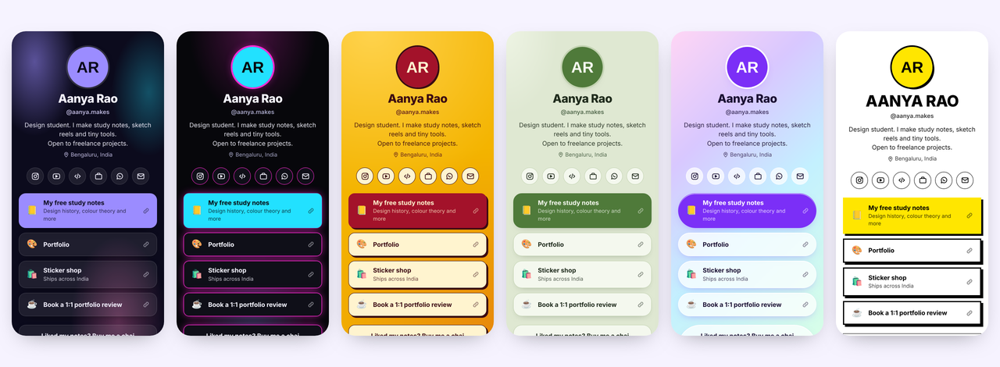

<p align="center"></p>

<p align="center">
  <a href="https://maheshsurada9434.github.io/mylinks/"><b>👀 See a live page</b></a> ·
  <a href="https://maheshsurada9434.github.io/mylinks/editor/"><b>✏️ Try the editor</b></a> ·
  <a href="#-get-your-page-in-2-minutes"><b>🍴 Make your own</b></a>
</p>

<p align="center">
  <a href="https://github.com/maheshsurada9434/mylinks/actions/workflows/deploy.yml"></a>
  
  
  <a href="LICENSE"></a>
</p>

**mylinks is a free link-in-bio page that you own.** No subscription, no ads, no "upgrade to remove branding". Fork this repo, put your links in one file, and GitHub hosts your page for free at `https://<you>.github.io/mylinks/`.

It's made for creators, students and small businesses, with things paid services charge extra for or don't have at all:

- 💸 **Pay via UPI button** that opens GPay, PhonePe or Paytm, plus copy-UPI-ID
- 🤖 **Readable by AI agents.** Every page publishes [`llms.txt`](https://llmstxt.org) and schema.org data, so ChatGPT, Claude, Perplexity and AI search can describe you correctly
- 🎨 **8 themes**: Aurora, Notebook, Masala, Neon, Matcha, Y2K, Mono and Sunset
- ✏️ **No-code editor** with a live phone preview. Edit from your phone
- 📇 **Save my contact** (vCard), **Share** button, WhatsApp and Telegram links
- 🖼️ **Automatic share image**, so your link looks good when posted on WhatsApp, X or LinkedIn
- 🎬 **Featured YouTube video** embed
- ⚡ **Tiny and fast**: one HTML file, zero dependencies, no tracking

<p align="center"></p>

## 🍴 Get your page in 2 minutes

All of this works from your phone.

1. **Fork** this repo (top right). You can rename it, or name it `<you>.github.io` to get the shorter address `https://<you>.github.io`.
2. In your fork, go to **Settings → Pages** and set **Source** to **GitHub Actions**.
3. Go to **Actions** and enable workflows, then open **Publish page → Run workflow**.

About a minute later your page is live at `https://<you>.github.io/mylinks/`.

### Make it yours

**Easy way:** open `https://<you>.github.io/mylinks/editor/`, fill in the form, tap **Publish**, and paste into GitHub when it asks.

**Or edit [`profile.json`](profile.json) directly:**

```json
{
  "name": "Aanya Rao",
  "handle": "aanya.makes",
  "bio": "Design student. I make study notes and tiny tools.",
  "location": "Bengaluru, India",
  "avatar": "avatar.jpg",
  "theme": "masala",
  "links": [
    { "emoji": "📒", "title": "Free study notes", "url": "https://…", "highlight": true },
    { "emoji": "🛍️", "title": "Sticker shop", "subtitle": "Ships across India", "url": "https://…" }
  ],
  "socials": { "instagram": "aanya.makes", "youtube": "aanyamakes", "whatsapp": "+91 98765 43210" },
  "youtube": "https://youtu.be/…",
  "upi": { "id": "aanya@upi", "note": "Buy me a chai" }
}
```

| Field | What it does |
| --- | --- |
| `avatar` | An image link, or a file you upload to the repo (`avatar.jpg`). Leave empty to show your initials |
| `theme` | `aurora` `notebook` `masala` `neon` `matcha` `y2k` `mono` `sunset` |
| `links[].highlight` | Makes a link stand out in the accent colour |
| `socials` | `instagram` `youtube` `x` `threads` `github` `linkedin` `whatsapp` `telegram` `email` `phone` `spotify` `facebook` `discord` `website` |
| `upi` | Shows a Pay via UPI card. Remove it to hide |
| `contact` | Set to `false` to hide the Save contact button |

Every change you commit republishes the page automatically.

## 🤖 Why "AI-ready"?

More and more people find others by asking an AI assistant instead of searching. mylinks publishes your page in the formats those tools read:

- **`/llms.txt`**: a plain-text summary of you and your links, following the [llms.txt](https://llmstxt.org) proposal
- **schema.org `Person` data** with your profiles linked as `sameAs`
- **`sitemap.xml`** and `robots.txt` so your page gets indexed

## 🧱 How it works

```
profile.json            your content (the only file you need to edit)
src/render.js           turns profile.json into the page (also powers the editor preview)
editor/index.html       the no-code editor
scripts/build.mjs       builds dist/: index.html, llms.txt, contact.vcf, sitemap
.github/workflows/      builds, makes the share image and publishes to GitHub Pages
```

Run it locally with `node scripts/build.mjs` and open `dist/index.html`. Node 18 or newer, nothing to install.

## 🗺️ Help build it

Good first issues are labelled in [Issues](../../issues). Ideas:

- A QR code of your page, for posters and shop counters
- More themes (send yours!)
- Hindi and other Indian languages for the button labels
- Click counts that stay private (no third-party analytics)
- Sections: "Now playing", latest blog posts, a product grid

See [CONTRIBUTING.md](CONTRIBUTING.md).

## ⭐ If you like it

Star the repo and share your page. A link back is appreciated but not required.

## License

[MIT](LICENSE)
